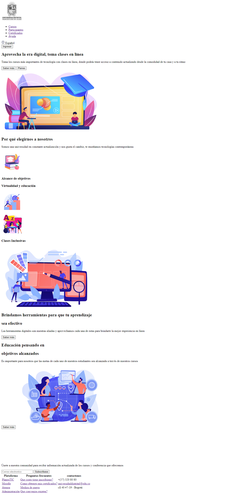
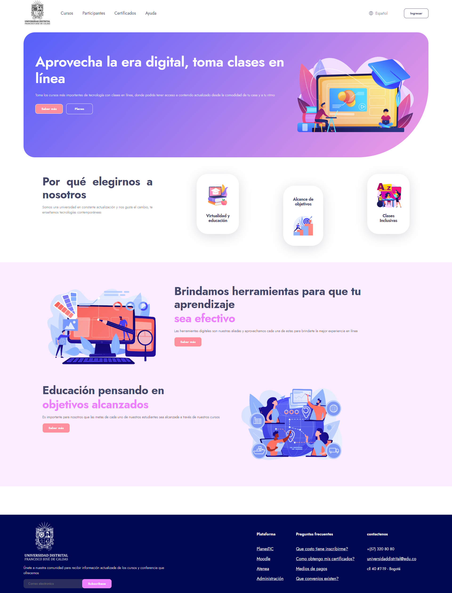
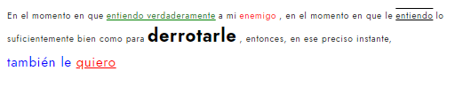
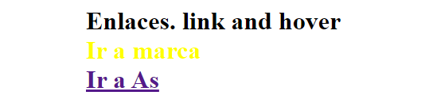
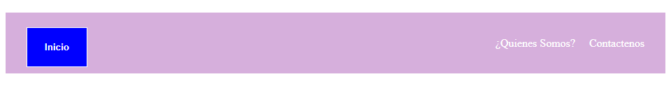
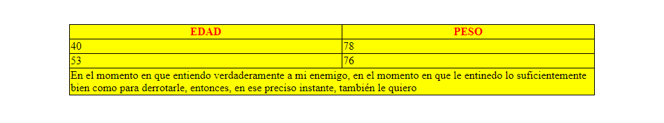

<h1>Taller 9: Jeison Steven Perez</h1>

<h2>Información</h2>

Curso: Full Stack Básico - Grupo 1

Profesor: Cristian Patiño

<h2>: Link pagina web </h2>
<a href="https://jesperm1994.github.io/Taller-9-Fullstack-jspm/">Link de pag web</a>
<h2>Punto 1: Link de figma</h2>
<a href="https://www.figma.com/file/cBrd91OBhVkwUCaJ03nhUp/Jeison-Perez-Figma-excercise?type=design&node-id=1-523&mode=design&t=vPpfX7QDvw9jA3ld-0">Link de Figma</a>

<h2>Punto 2: HTML<h2>

<h2>Punto 3: CSS<h2>

<h2>Punto 4: TEXTO<h2>

<h2>Punto 5: TEXTO<h2>

<h2>Punto 6: TEXTO<h2>

<h2>Punto 7-8: TEXTO<h2>

<h2>Punto 9: TABLA<h2>

